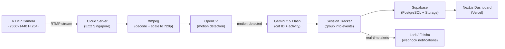
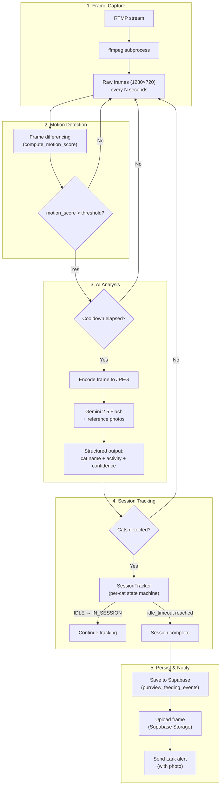
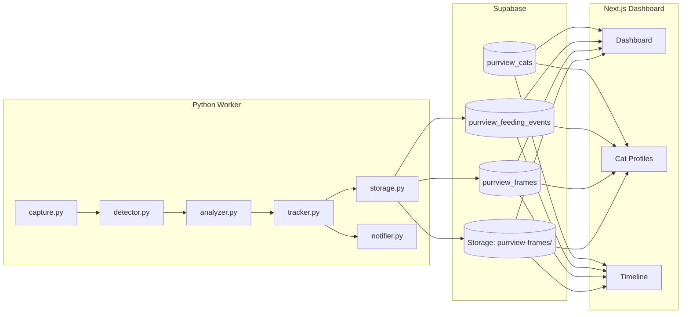

# PurrView

**English | [中文](./README_CN.md)**

**AI-powered care for 5 beloved rescue cats.**

An open-source monitoring system that watches over 5 rescue cats — tracking every meal, sip, and visit with computer vision and Gemini AI, so they never miss a beat.

<p align="center">
  
</p>

<p align="center">
  <a href="https://purrview.vercel.app">Live Dashboard</a> · <a href="#architecture">Architecture</a> · <a href="#getting-started">Getting Started</a>
</p>

---

## Meet the Cats

| | | | | |
|:---:|:---:|:---:|:---:|:---:|
|  |  |  |  |  |
| **Majiang** | **Songhua** | **Xiaohei** | **Daji** | **Xiaoman** |
| The OG rescue — a stray-turned-hero-mom who raised a dozen kittens. | Majiang's son. A big cuddly boy who's also the biggest scaredy-cat. | Once hired by a restaurant to hunt mice. Now a retired sun-worshipper. | Thinks he's a dog. Best personality in the house, and the biggest appetite. | Lost one eye to surgery — only then did her gentle side come through. |

---

## Architecture

### System Overview



### Processing Pipeline



### Data Flow



---

## Tech Stack

| Layer | Technology |
|-------|-----------|
| **Camera** | RTMP IP camera (2560×1440, H.264, 25fps) |
| **Stream Worker** | Python 3.12, ffmpeg, OpenCV, google-genai (Gemini 2.5 Flash) |
| **Database** | Supabase (PostgreSQL + Storage) |
| **Web Dashboard** | Next.js 15 (App Router), Tailwind CSS, Recharts |
| **Deploy** | Worker on EC2 (Docker), Dashboard on Vercel |
| **Notifications** | Lark (Feishu) webhooks |

---

## Getting Started

### Prerequisites

- Python 3.12+
- Node.js 18+
- ffmpeg installed (`brew install ffmpeg` or `apt install ffmpeg`)
- An RTMP camera on your local network
- Supabase project (free tier works)
- Google Gemini API key

### 1. Clone the repo

```bash
git clone https://github.com/6m1w/project_purrview.git
cd project_purrview
```

### 2. Set up environment variables

```bash
cp .env.example .env
```

Edit `.env` and fill in your values:

```env
# Supabase
SUPABASE_URL=https://your-project.supabase.co
SUPABASE_KEY=your-service-role-key

# Google Gemini
GEMINI_API_KEY=your-gemini-api-key
GEMINI_MODEL=gemini-2.5-flash

# RTMP Stream
RTMP_URL=rtmp://your-camera-ip/live/stream

# Worker Settings
FRAME_INTERVAL=2          # seconds between frame extraction
MOTION_THRESHOLD=500      # motion sensitivity (lower = more sensitive)
MOTION_COOLDOWN=30        # seconds between Gemini API calls
IDLE_TIMEOUT=60           # seconds of inactivity to end a session

# Lark Notifications (optional)
LARK_WEBHOOK_URL=         # leave empty to disable
```

### 3. Set up Supabase

Run the migration files in `supabase/migrations/` to create the required tables:

- `purrview_cats` — cat profiles with reference photos
- `purrview_feeding_events` — grouped feeding/drinking events
- `purrview_frames` — key frames captured during events
- `purrview_food_bowls` — food bowl ROI configuration

All tables use the `purrview_` prefix and have RLS enabled (public read, service-role write).

### 4. Prepare reference photos

Create a `data/refs/` directory with:

```
data/refs/
├── refs.json         # cat names + descriptions
├── majiang.jpg       # reference photo for each cat
├── songhua.jpg
├── xiaohei.jpg
├── daji.jpg
└── xiaoman.jpg
```

These photos are sent to Gemini alongside each frame for cat identification.

### 5. Start the Worker

```bash
cd apps/worker
python3 -m venv .venv
source .venv/bin/activate
pip install -e ".[dev]"

# Run the worker
python -m src.main
```

The worker will:
1. Connect to the RTMP stream via ffmpeg
2. Extract frames every `FRAME_INTERVAL` seconds
3. Detect motion using frame differencing
4. Send frames to Gemini when motion exceeds the threshold
5. Track feeding sessions per cat
6. Save events to Supabase and send Lark notifications

### 6. Start the Web Dashboard

```bash
cd apps/web
npm install
cp ../../.env .env.local   # reuse the same env vars
npm run dev
```

Open [http://localhost:3000](http://localhost:3000) to see the dashboard.

---

## Project Structure

```
project_purrview/
├── apps/
│   ├── worker/                 # Python stream processing
│   │   ├── src/
│   │   │   ├── main.py         # Entry point — capture → detect → analyze → track → store
│   │   │   ├── capture.py      # RTMP → ffmpeg → raw frames
│   │   │   ├── detector.py     # OpenCV MOG2 motion detection
│   │   │   ├── analyzer.py     # Gemini multimodal cat identification
│   │   │   ├── tracker.py      # Per-cat session state machine
│   │   │   ├── storage.py      # Supabase persistence + frame upload
│   │   │   ├── notifier.py     # Lark webhook alerts
│   │   │   ├── config.py       # Pydantic settings
│   │   │   ├── collect.py      # Data collection tool (for training)
│   │   │   └── digest.py       # Daily digest cron script
│   │   ├── tests/
│   │   ├── Dockerfile
│   │   └── pyproject.toml
│   └── web/                    # Next.js 15 dashboard
│       ├── src/
│       │   ├── app/            # Pages: /, /dashboard, /cats, /timeline
│       │   ├── components/     # React components (brutalist design)
│       │   └── lib/queries.ts  # Supabase queries
│       └── package.json
├── supabase/migrations/        # SQL schema migrations
├── scripts/
│   └── ec2-collect.sh          # EC2 data collection helper
├── .env.example
└── README.md
```

---

## Key Commands

```bash
# Worker
cd apps/worker && pip install -e ".[dev]"
cd apps/worker && pytest                    # run tests

# Web
cd apps/web && npm install
cd apps/web && npm run dev                  # dev server
cd apps/web && npm run build                # production build

# Data collection (EC2)
./scripts/ec2-collect.sh setup              # first-time setup
./scripts/ec2-collect.sh start              # start 24h collection
./scripts/ec2-collect.sh status             # check progress
```

---

## How It Works

1. **An RTMP camera** streams 1440p video of the feeding area
2. **ffmpeg** decodes the stream and scales frames down to 720p
3. **OpenCV frame differencing** detects motion — when a cat walks up, the motion score spikes
4. **Gemini 2.5 Flash** receives the frame + reference photos of each cat, and returns a structured response: which cat, what activity (eating / drinking / just present), and confidence score
5. **SessionTracker** groups consecutive detections into feeding sessions (one per cat per visit)
6. When a session ends (no activity for 60s), the event is **saved to Supabase** and a **Lark notification** is sent with a photo
7. The **Next.js dashboard** reads from Supabase and displays real-time stats, charts, and a full event timeline

---

## License

MIT
