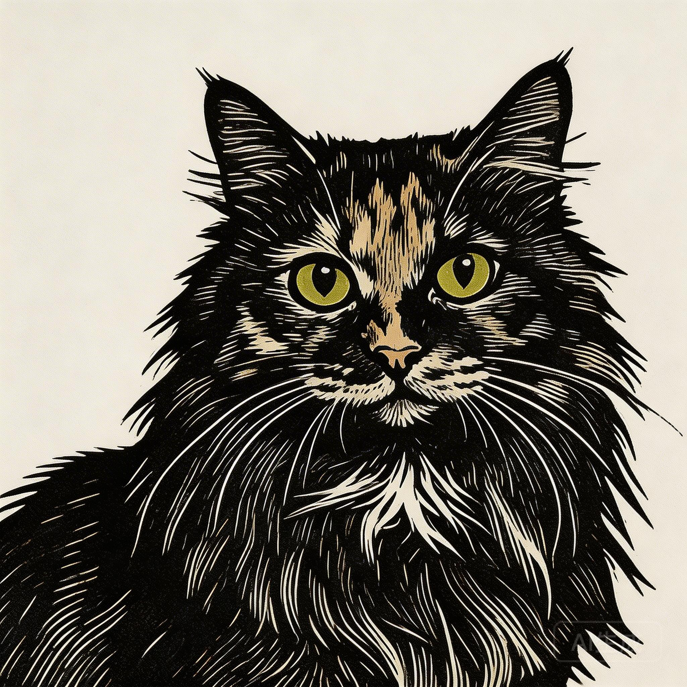
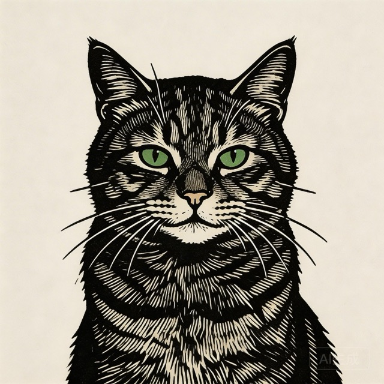
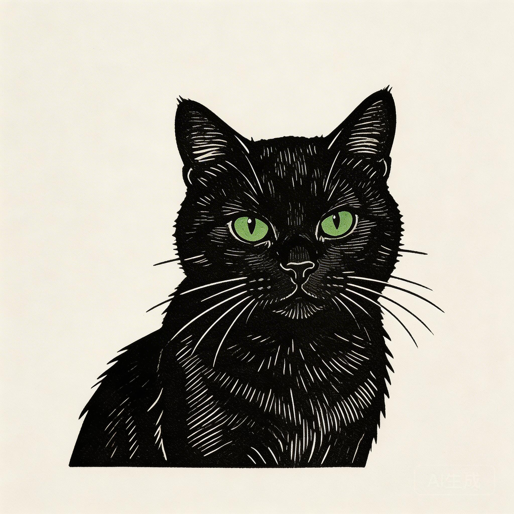
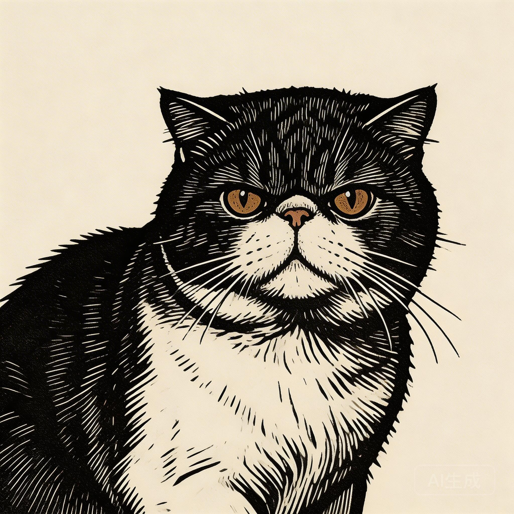
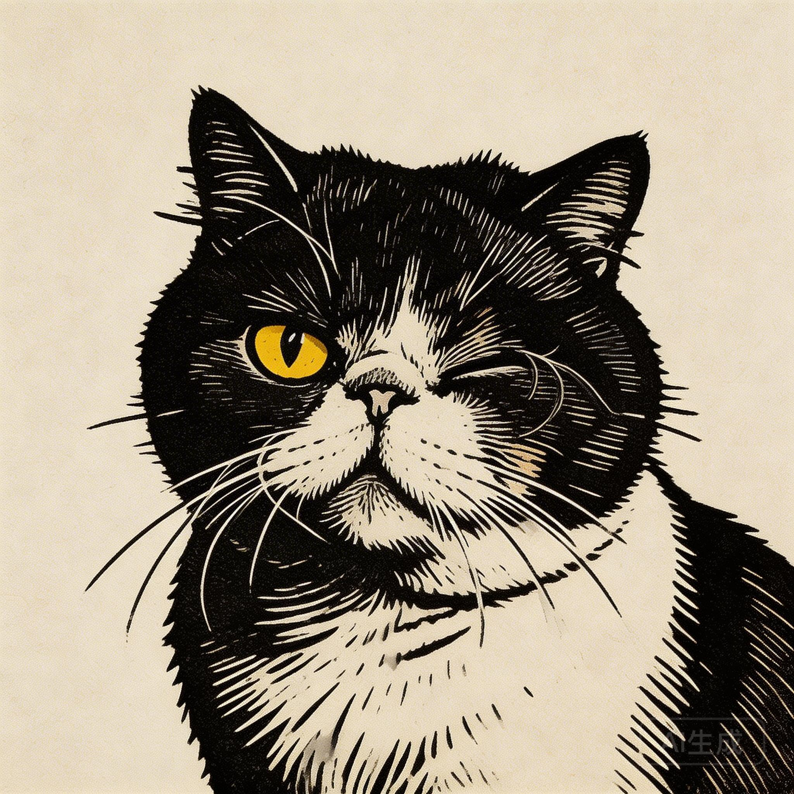
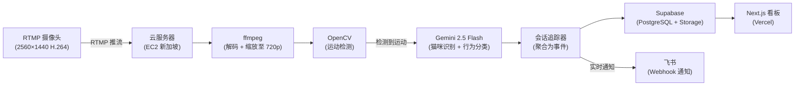
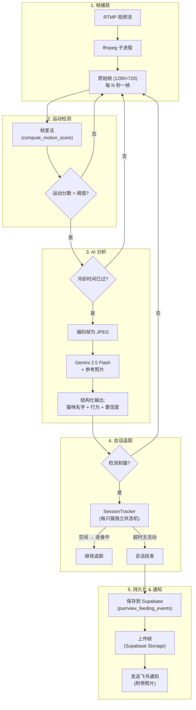
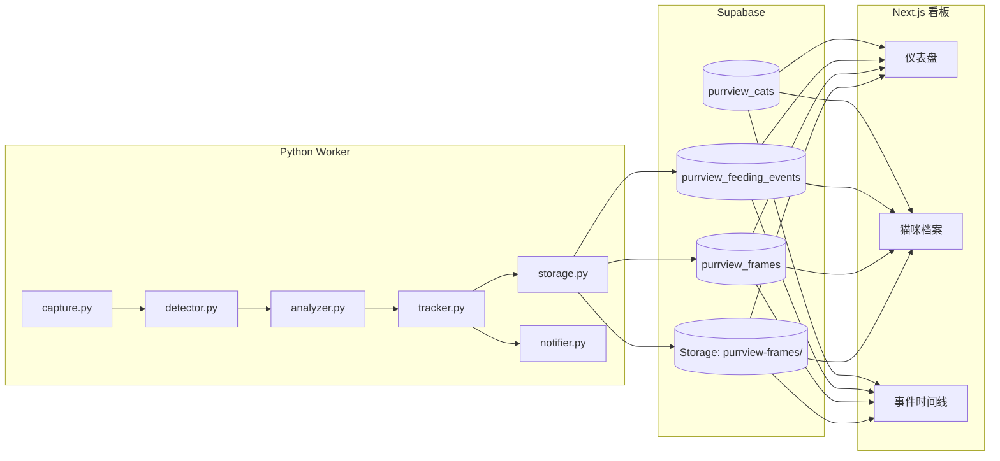

# PurrView

**[English](./README.md) | 中文**

**用 AI 守护 5 只心爱的救助猫。**

一个开源的猫咪监控系统 — 通过计算机视觉和 Gemini AI 追踪每一餐、每一口水、每一次到访，确保它们的一切都被照料到。

<p align="center">
  
</p>

<p align="center">
  <a href="https://purrview.dev">在线看板</a> · <a href="#系统架构">系统架构</a> · <a href="#快速开始">快速开始</a>
</p>

---

## 认识这些猫

| | | | | |
|:---:|:---:|:---:|:---:|:---:|
|  |  |  |  |  |
| **麻酱** | **松花** | **小黑** | **大吉** | **小慢** |
| 初代救助猫，从流浪猫变成英雄妈妈，养大了一窝小猫。 | 麻酱的儿子，又大又粘人，但也是家里最胆小的。 | 曾经被饭店雇来抓老鼠，现在退休专职晒太阳。 | 以为自己是只狗，性格全家最好，饭量也全家最大。 | 因手术失去了一只眼睛，从此反而变得温柔起来。 |

---

## 系统架构

### 整体概览



### 处理流水线



### 数据流向



---

## 技术栈

| 层级 | 技术 |
|------|-----|
| **摄像头** | RTMP IP 摄像头 (2560×1440, H.264, 25fps) |
| **流处理 Worker** | Python 3.12, ffmpeg, OpenCV, google-genai (Gemini 2.5 Flash) |
| **数据库** | Supabase (PostgreSQL + Storage) |
| **Web 看板** | Next.js 15 (App Router), Tailwind CSS, Recharts |
| **部署** | Worker 在 EC2 (Docker)，看板在 Vercel |
| **通知** | 飞书 Webhooks |

---

## 快速开始

### 前置条件

- Python 3.12+
- Node.js 18+
- 安装 ffmpeg（`brew install ffmpeg` 或 `apt install ffmpeg`）
- 局域网内的 RTMP 摄像头
- Supabase 项目（免费版即可）
- Google Gemini API 密钥

### 1. 克隆仓库

```bash
git clone https://github.com/6m1w/project_purrview.git
cd project_purrview
```

### 2. 配置环境变量

```bash
cp .env.example .env
```

编辑 `.env` 并填入你的值：

```env
# Supabase
SUPABASE_URL=https://your-project.supabase.co
SUPABASE_KEY=your-service-role-key

# Google Gemini
GEMINI_API_KEY=your-gemini-api-key
GEMINI_MODEL=gemini-2.5-flash

# RTMP 视频流
RTMP_URL=rtmp://your-camera-ip/live/stream

# Worker 设置
FRAME_INTERVAL=2          # 帧提取间隔（秒）
MOTION_THRESHOLD=500      # 运动灵敏度（越低越灵敏）
MOTION_COOLDOWN=30        # Gemini API 调用冷却时间（秒）
IDLE_TIMEOUT=60           # 无活动多久后结束会话（秒）

# 飞书通知（可选）
LARK_WEBHOOK_URL=         # 留空则不启用通知
```

### 3. 配置 Supabase

运行 `supabase/migrations/` 中的迁移文件来创建所需的表：

- `purrview_cats` — 猫咪档案和参考照片
- `purrview_feeding_events` — 聚合后的进食/喝水事件
- `purrview_frames` — 事件中捕获的关键帧
- `purrview_food_bowls` — 食碗 ROI 区域配置

所有表使用 `purrview_` 前缀，并启用 RLS（公开读取，service-role 写入）。

### 4. 准备参考照片

创建 `data/refs/` 目录：

```
data/refs/
├── refs.json         # 猫咪名称 + 描述
├── majiang.jpg       # 每只猫的参考照片
├── songhua.jpg
├── xiaohei.jpg
├── daji.jpg
└── xiaoman.jpg
```

这些照片会随每一帧一起发送给 Gemini，用于猫咪识别。

### 5. 启动 Worker

```bash
cd apps/worker
python3 -m venv .venv
source .venv/bin/activate
pip install -e ".[dev]"

# 运行 Worker
python -m src.main
```

Worker 启动后会：
1. 通过 ffmpeg 连接 RTMP 视频流
2. 每 `FRAME_INTERVAL` 秒提取一帧
3. 用帧差法检测运动
4. 当运动超过阈值时，将帧发送给 Gemini
5. 按猫咪分别追踪进食会话
6. 将事件保存到 Supabase 并发送飞书通知

### 6. 启动 Web 看板

```bash
cd apps/web
npm install
cp ../../.env .env.local   # 复用相同的环境变量
npm run dev
```

打开 [http://localhost:3000](http://localhost:3000) 查看看板。

---

## 项目结构

```
project_purrview/
├── apps/
│   ├── worker/                 # Python 流处理
│   │   ├── src/
│   │   │   ├── main.py         # 入口 — 捕获 → 检测 → 分析 → 追踪 → 存储
│   │   │   ├── capture.py      # RTMP → ffmpeg → 原始帧
│   │   │   ├── detector.py     # OpenCV MOG2 运动检测
│   │   │   ├── analyzer.py     # Gemini 多模态猫咪识别
│   │   │   ├── tracker.py      # 每只猫独立的会话状态机
│   │   │   ├── storage.py      # Supabase 持久化 + 帧上传
│   │   │   ├── notifier.py     # 飞书 Webhook 通知
│   │   │   ├── config.py       # Pydantic 配置管理
│   │   │   ├── collect.py      # 数据采集工具（用于训练）
│   │   │   └── digest.py       # 每日摘要定时任务
│   │   ├── tests/
│   │   ├── Dockerfile
│   │   └── pyproject.toml
│   └── web/                    # Next.js 15 看板
│       ├── src/
│       │   ├── app/            # 页面: /, /dashboard, /cats, /timeline
│       │   ├── components/     # React 组件（粗野主义设计）
│       │   └── lib/queries.ts  # Supabase 查询
│       └── package.json
├── supabase/migrations/        # SQL 数据库迁移
├── scripts/
│   └── ec2-collect.sh          # EC2 数据采集脚本
├── .env.example
└── README.md
```

---

## 常用命令

```bash
# Worker
cd apps/worker && pip install -e ".[dev]"
cd apps/worker && pytest                    # 运行测试

# Web
cd apps/web && npm install
cd apps/web && npm run dev                  # 开发服务器
cd apps/web && npm run build                # 生产构建

# 数据采集（EC2）
./scripts/ec2-collect.sh setup              # 首次配置
./scripts/ec2-collect.sh start              # 启动 24 小时采集
./scripts/ec2-collect.sh status             # 检查采集状态
```

---

## 工作原理

1. **RTMP 摄像头**以 1440p 分辨率拍摄猫咪进食区域的视频流
2. **ffmpeg** 解码视频流并将帧缩放到 720p
3. **OpenCV 帧差法**检测运动 — 当猫走过来时，运动分数会飙升
4. **Gemini 2.5 Flash** 接收当前帧 + 每只猫的参考照片，返回结构化结果：哪只猫、在做什么（吃饭/喝水/只是路过）、以及置信度
5. **SessionTracker** 将连续的检测结果聚合为进食会话（每只猫每次到访一个会话）
6. 当会话结束（60 秒无活动）时，事件被**保存到 Supabase**，同时发送**飞书通知**（附带照片）
7. **Next.js 看板**从 Supabase 读取数据，展示实时统计、图表和完整的事件时间线

---

## License

MIT
